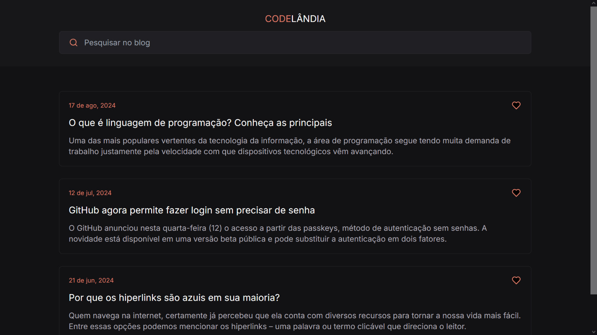

## 💻

## O projeto trás algumas notícias e a barra de pesquisa que permite que o usuário pesquise pelo título, palavras-chave, e elementos do texto. Também tem a opção de favoritar.

## 🛠️ Tecnologias utilizadas:

- **NextJS**
- **React**
- **TypeScript**
- **Tailwind CSS**

## Acesse o site por aqui -> (https://desafio1-lemon.vercel.app/)

## 📟 Layout da aplicação:




## ⚙️ Instalação:

1. **Clone o repositório:**

```bash
$ git clone https://github.com/JhulyBastos/codelandia-desafio-1.git
```

2. **Instale as dependências do frontend:**

   ```bash
   npm install
   ```

## 💻 Execução

Em seu terminal, execute o comando:

```bash
npm run dev
```

A aplicação irá rodar no endereço `http://localhost:3000/`
